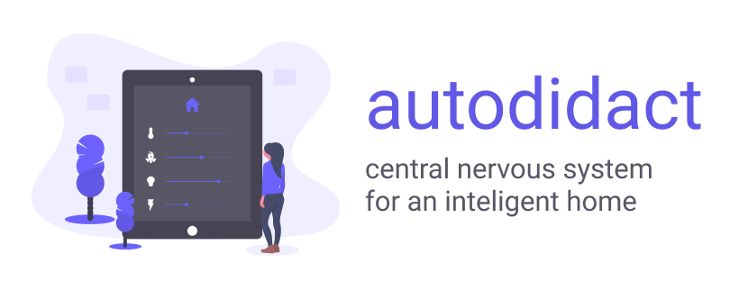

# 

## Overview

**autodidact** is a system that acts as the central nervous system for inteligent homes. an inteligent home is more than a smart home — it's a home that learns, evolves, and adapts to best suit the needs of its inhabitants

## Objectives

- create an abstraction that translates all devices and interfaces in an existing smart home into a common language and interface
- speak Apple's HomeKit protocol fluently as a reference implementation
- be effortlessly extensible on all fronts: it should be just as easy to add additional devices as it is to teach the system to speak an entirely new protocol
- smell (freshly roasted beans) and sound (smooth jazz) likes the local coffee shop during the holidays
